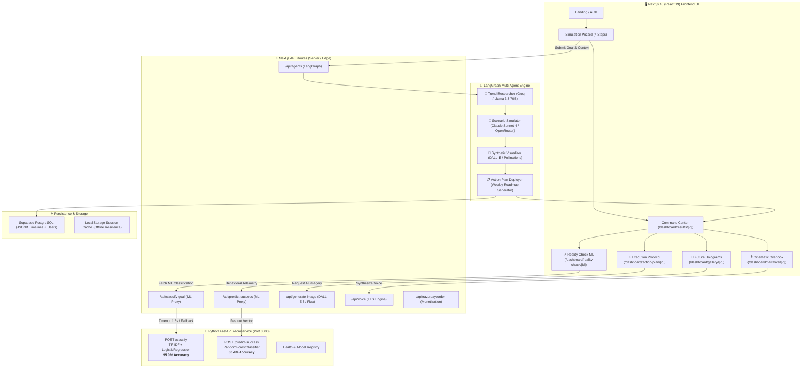
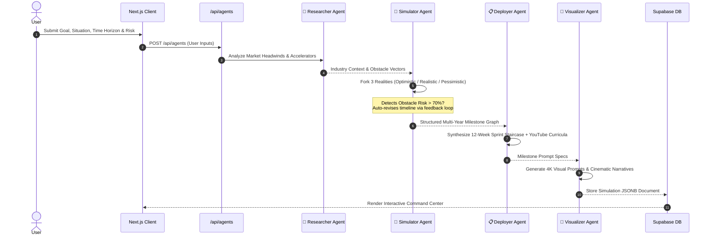

<div align="center">

# 🌌 VibeForge — AI Life Simulator & Multiverse Architect

### *Simulate Parallel Realities. Predict Outcomes with ML. Conquer Your Trajectory.*

[](https://nextjs.org)
[](https://react.dev)
[](https://python.org)
[](https://fastapi.tiangolo.com)
[](https://scikit-learn.org)
[](https://threejs.org)
[](https://tailwindcss.com)
[](https://langchain-ai.github.io/langgraph/)
[](https://supabase.com)

<p align="center">
  <a href="#-system-architecture">Architecture</a> •
  <a href="#-key-modules--portals">Features & Portals</a> •
  <a href="#-machine-learning-engine">ML Engine</a> •
  <a href="#-3d-visual-chamber">3D Visuals</a> •
  <a href="#-quick-start">Quick Start</a> •
  <a href="#-api-endpoints">API Docs</a>
</p>

</div>

---

## 🎯 Executive Overview

**VibeForge** is a full-stack, AI-powered life simulation and multi-agent execution ecosystem. By combining **LangGraph multi-agent cognitive pipelines**, **Scikit-learn behavioral and career machine learning models**, and **React Three Fiber 3D visual environments**, VibeForge enables users to:

1. **Synthesize Parallel Timelines**: Generate deterministic Optimistic, Realistic, and Pessimistic future trajectories across 3, 6, and 12-month time horizons.
2. **Execute with Real-World Grounding (Reality Check)**: Classify unstructured career goals into industry taxonomy using a trained NLP classifier, displaying live market demand, compensation benchmarks, and critical skill matrices.
3. **Forecast Completion Likelihood (Success ML)**: Predict on-time goal completion dynamically based on behavioral check-in velocity, completion slopes, and timeline buffer ratios via a trained Random Forest model.
4. **Step-by-Step 3D Holographic Chamber**: Step into a hyper-futuristic 3D inspection room to examine future milestone cards, synthetic memories, and AI-generated visuals.
5. **Gamified Protocol Execution**: Execute weekly action sprints with live YouTube tutorial integration, milestone coupon unlocks (up to 50% lifetime discount), and automated calendar/PDF export.

---

## 🏗️ System Architecture



---

## 🔬 Multi-Agent Cognitive Workflow



---

## ⚡ Key Modules & Portals

### 1. 🎯 Command Center (`/dashboard/results/[id]`)
- **Multiverse Branching Timeline**: Interactive 3D particle graph visualizing the diverging trajectories of Optimistic, Realistic, and Pessimistic paths.
- **Multiverse Risk Splitter**: Trigger *"⚠️ Take a Massive Risk"* to calculate real-time timeline shatter scenarios (*100x Growth vs. Bankruptcy Recovery*).
- **Motivational Hero Transmission**: High-octane executive mandate synthesis dynamically generated from the user's subconscious goals.

### 2. ⚡ Reality Check ML Panel (`/dashboard/reality-check/[id]`)
- **Goal-to-Career NLP Classifier**: Free-text goal classification into 6 taxonomy classes (`ml_engineer`, `full_stack_dev`, `commercial_pilot`, `data_scientist`, `product_manager`, `other`).
- **Real-World Metric Cards**:
  - 🌐 **Market Demand** (e.g., `14,200+ open roles globally this week`)
  - 💰 **Average Entry–Senior Salary** (e.g., `₹8L – ₹28L / year (India) | $95K – $195K (US)`)
  - ⚡ **Top In-Demand Skills** & Top Hiring Tech Companies
- **Confidence & Source Transparency**: Displays exact model confidence percentage (`95% confidence`) or graceful `"keyword match"` fallback badge when running offline.

### 3. ⚡ Execution Protocol (`/dashboard/action-plan/[id]`)
- **AI Success Forecast Card**: Predicts on-time completion likelihood via behavioral telemetry (`On Track` vs `At Risk` with animated probability dial).
- **12-Week Interactive Sprint Staircase**: Check off actionable tasks, sync mindset routines, and open direct video tutorials.
- **Gamified Reward Milestones**:
  - 🥉 **25%**: Bronze Executioner (`MILESTONE10` → 10% OFF)
  - 🥈 **50%**: Silver Architect (`EXECUTION25` → 25% OFF)
  - 🥇 **75%**: Gold Visionary (`GRIND35` → 35% OFF)
  - 👑 **100%**: Galactic Sovereign (`MASTERY50` → 50% Lifetime OFF)
- **1-Click ICS & PDF Export**: Synchronize milestones directly to Apple/Google Calendar or generate print-ready executive briefing sheets.

### 4. 🔮 Future Holograms 3D Chamber (`/dashboard/gallery/[id]`)
- **Hologram Chamber Stage**: 3D rotating laser rings, glowing light beam emitter, scanline shaders, and volumetric particle dust.
- **Step-by-Step Navigation**: Step forward/backward through milestone cards (`‹ Prev` / `Next ›`, Arrow keys, Spacebar auto-rotate).
- **Interactive Scrubber & Inspector**: Full timeline scrubber bar (`M3`, `M6`, `M12`) with click-to-expand high-resolution synthetic memory viewer.

### 5. 🎙️ Cinematic Overlook (`/dashboard/narrative/[id]`)
- **3D Cosmic Audio Lounge**: Orbiting cyber crystal shards and starfields.
- **Voice Narration & Live Teleprompter**: Synchronized audio narration with variable speed playback (`1x`, `1.5x`, `2x`) and paragraph tracking.

---

## 🤖 Machine Learning Engine

VibeForge includes a dedicated Python machine learning pipeline serving real-time inferences to the Next.js frontend via FastAPI.

```
ml/
├── data/
│   ├── career_goals_dataset.csv     # 100+ curated goal samples across 6 categories
│   └── success_dataset.csv          # 280-row behavioral synthetic telemetry dataset
├── models/
│   ├── vectorizer.pkl               # Fitted TfidfVectorizer (ngram_range=(1,2))
│   ├── classifier.pkl               # Trained LogisticRegression Career Classifier (95% Acc)
│   └── success_model.pkl            # Trained RandomForest Success Predictor (80.4% Acc)
├── train_classifier.py              # Classifier training & evaluation pipeline
├── train_success_model.py           # Success model training & feature importance pipeline
├── serve.py                         # Production FastAPI microservice (CORS-enabled)
└── requirements.txt                 # Python dependency specifications
```

### 1. Goal-to-Career Classifier (`train_classifier.py`)
- **Architecture**: `TfidfVectorizer(ngram_range=(1, 2), sublinear_tf=True)` + `LogisticRegression(C=5.0)`
- **Evaluation**: **95.0% Accuracy** on held-out test split.
- **Classification Report**:
  ```
                    precision    recall  f1-score   support
  commercial_pilot       1.00      1.00      1.00         4
    data_scientist       1.00      1.00      1.00         3
    full_stack_dev       1.00      1.00      1.00         3
       ml_engineer       0.80      1.00      0.89         4
             other       1.00      0.67      0.80         3
   product_manager       1.00      1.00      1.00         3
          accuracy                           0.95        20
  ```

### 2. Success Probability Predictor (`train_success_model.py`)
- **Architecture**: `RandomForestClassifier(n_estimators=200, max_depth=6, class_weight='balanced')`
- **Features Extracted**:
  1. `avg_completion_percent`: Mean checklist completion across all check-ins (Weight: **58.6%**)
  2. `completion_trend`: Velocity slope over the last 3 check-ins (Weight: **18.2%**)
  3. `num_checkins_missed`: Number of elapsed weeks without check-ins (Weight: **12.5%**)
  4. `weeks_elapsed_ratio`: Elapsed weeks divided by total timeline horizon (Weight: **10.7%**)
- **Evaluation**: **80.4% Accuracy** on 56 test samples.

---

## 🛠️ Complete Tech Stack

| Layer | Technology | Purpose |
|---|---|---|
| **Frontend Framework** | **Next.js 16 (App Router)** | High-performance React 19 web application |
| **Language** | **TypeScript 5** | Strict end-to-end type safety |
| **Styling & Design** | **Tailwind CSS v4 + Vanilla CSS Tokens** | 24-depth glassmorphism design system |
| **3D Rendering** | **Three.js + React Three Fiber + Drei** | Holographic 3D chambers, particle timelines & VibeCore |
| **Animations** | **Framer Motion 12** | Micro-interactions, page transitions, and modals |
| **ML Microservice** | **FastAPI + Uvicorn** | High-throughput async model inference engine |
| **ML Libraries** | **Scikit-Learn + Pandas + NumPy + Joblib** | TF-IDF, Logistic Regression & Random Forest models |
| **AI Orchestration** | **LangGraph (@langchain/langgraph)** | Stateful multi-agent planning and feedback graphs |
| **AI Inference** | **Claude Sonnet 4, Llama 3.3 70B (Groq)** | Persona synthesis, obstacle detection, and roadmaps |
| **Visual Generation** | **DALL-E 3 & Flux / Pollinations AI** | Synthetic visual memories and holographic asset synthesis |
| **Voice Engine** | **ElevenLabs Text-to-Speech** | Studio-grade cinematic narrations |
| **Database** | **Supabase (PostgreSQL + pgvector)** | Relational roadmap storage & embedding indexing |
| **Payments** | **Razorpay & Demo Sandbox** | Tiered subscription checkout with automated coupon logic |

---

## 🚀 Quick Start Guide

### Prerequisites
- **Node.js**: v18.18.0 or higher
- **Python**: v3.10 or higher
- **npm** or **pnpm**

---

### Step 1: Clone the Repository
```bash
git clone https://github.com/lokojitcoder123/VibeForge.git
cd VibeForge
```

---

### Step 2: Set Up Python ML Microservice
```bash
# Navigate to the ML directory
cd ml

# Install Python ML dependencies
python -m pip install -r requirements.txt

# Train both ML models (generates .pkl model artifacts)
python train_classifier.py
python train_success_model.py

# Start the FastAPI ML service on port 8000
python -m uvicorn serve:app --reload --port 8000
```
> The ML service is now live at `http://127.0.0.1:8000` with Swagger UI at `http://127.0.0.1:8000/docs`.

---

### Step 3: Configure Environment Variables
In the project root, duplicate the example environment file:
```bash
cp .env.local.example .env.local
```

Populate `.env.local` with your API keys:
```env
# AI Providers
OPENROUTER_API_KEY=your_openrouter_key
GROQ_API_KEY=your_groq_key
ANTHROPIC_API_KEY=your_anthropic_key
OPENAI_API_KEY=your_openai_key
ELEVENLABS_API_KEY=your_elevenlabs_key

# Supabase (Optional for local demo mode)
NEXT_PUBLIC_SUPABASE_URL=https://your-project.supabase.co
NEXT_PUBLIC_SUPABASE_ANON_KEY=your_supabase_anon_key

# Razorpay (Optional — Demo sandbox active if left blank)
RAZORPAY_KEY_ID=rzp_test_placeholder
RAZORPAY_KEY_SECRET=rzp_test_placeholder
NEXT_PUBLIC_RAZORPAY_KEY_ID=rzp_test_placeholder
```

---

### Step 4: Run Next.js Frontend
In a new terminal window:
```bash
# In the repository root
npm install
npm run dev
```

Visit **[http://localhost:3000](http://localhost:3000)** in your browser! 🎉

---

## 🔌 API Endpoints Reference

### Python FastAPI Microservice (`http://localhost:8000`)

#### `GET /health`
Returns service and model registry status:
```json
{
  "status": "ok",
  "classifier_loaded": true,
  "success_model_loaded": true
}
```

#### `POST /classify`
Classifies free-text goals into career categories:
```json
// Request
{ "text": "I want to become a machine learning engineer at a top AI company" }

// Response
{
  "category": "ml_engineer",
  "confidence": 0.9093
}
```

#### `POST /predict-success`
Predicts roadmap completion probability using behavioral telemetry:
```json
// Request
{
  "avg_completion_percent": 72.5,
  "completion_trend": 1.5,
  "weeks_elapsed_ratio": 0.4,
  "num_checkins_missed": 1
}

// Response
{
  "status": "on_track",
  "probability": 0.9585
}
```

---

### Next.js API Routes (`http://localhost:3000/api`)

| Endpoint | Method | Description |
|---|---|---|
| `/api/classify-goal` | `POST` | Proxies to ML service with 1.5s timeout; falls back to static keyword taxonomy if offline |
| `/api/predict-success` | `POST` | Proxies behavioral feature vectors to the Random Forest model |
| `/api/agents` | `POST` | Triggers the multi-agent LangGraph generation workflow |
| `/api/generate-image` | `POST` | Generates 4K milestone synthetic imagery |
| `/api/voice` | `POST` | Generates text-to-speech audio streams for narrative timelines |
| `/api/razorpay/order` | `POST` | Generates payment orders (with automatic zero-config demo sandbox) |

---

## 📁 Repository Directory Structure

```
VibeForge-1/
├── ml/                                 # 🐍 Python ML Microservice
│   ├── data/
│   │   ├── career_goals_dataset.csv    # 100+ labeled career goal sentences
│   │   └── success_dataset.csv         # 280-row behavioral feature dataset
│   ├── models/
│   │   ├── vectorizer.pkl              # Saved TF-IDF Vectorizer
│   │   ├── classifier.pkl              # Saved LogisticRegression Classifier
│   │   └── success_model.pkl           # Saved RandomForest Classifier
│   ├── train_classifier.py             # Career classifier training script
│   ├── train_success_model.py          # Success prediction model training script
│   ├── serve.py                        # FastAPI microservice application
│   └── requirements.txt                # Python package requirements
├── src/
│   ├── app/
│   │   ├── page.tsx                    # Landing page & hero experience
│   │   ├── layout.tsx                  # Root HTML shell & global font definitions
│   │   ├── globals.css                 # 24-depth token system & Tailwind config
│   │   ├── checkout/[plan]/page.tsx    # Razorpay checkout with coupon engine
│   │   ├── dashboard/
│   │   │   ├── page.tsx                # Dashboard index
│   │   │   ├── simulate/page.tsx       # 4-Step simulation input wizard
│   │   │   ├── my-simulations/page.tsx # Saved simulation index
│   │   │   ├── settings/page.tsx       # User preferences & API key manager
│   │   │   ├── results/[id]/page.tsx   # 🎯 Command Center + 3D Multiverse Timeline
│   │   │   ├── action-plan/[id]/page.tsx # ⚡ Execution Protocol + Success ML Card
│   │   │   ├── reality-check/[id]/page.tsx # ⚡ Reality Check ML Page
│   │   │   ├── gallery/[id]/page.tsx   # 🔮 Future Holograms 3D Chamber
│   │   │   └── narrative/[id]/page.tsx # 🎙️ Cinematic Overlook Audio Room
│   │   └── api/                        # Next.js API Routes (classify, success, agents, etc.)
│   ├── components/
│   │   ├── RealityCheckPanel.tsx       # 3-Card Reality Check UI with ML confidence badge
│   │   ├── SuccessForecastCard.tsx     # On-Track/At-Risk probability ring card
│   │   ├── three/                      # Three.js 3D Viewport Components
│   │   │   ├── ParticleTimeline.tsx    # Interactive branching particle graph
│   │   │   ├── MotivationalHero.tsx    # Dynamic transmission backdrop
│   │   │   └── VibeCore.tsx            # Interactive Tamagotchi companion
│   │   └── ui/                         # Glassmorphic UI library (Button, Card, Badge, Input)
│   ├── data/
│   │   └── careerStats.json            # Industry demand, salary & skill benchmarks
│   ├── lib/
│   │   ├── demoSimulation.ts           # Instant demo fallback simulation data
│   │   └── agents/                     # LangGraph agent definitions & graph
│   └── types/                          # TypeScript definitions for agents & state
├── public/                             # Static assets, fonts, icons
├── package.json                        # Node.js dependencies & scripts
└── README.md                           # Documentation & system architecture
```

---

## 🔒 Offline & Fault-Tolerant Design

VibeForge is engineered so that **no single dependency failure breaks the user experience**:

- **ML Service Offline**: If FastAPI is offline or takes `>1.5s`, `/api/classify-goal` seamlessly switches to a rule-based NLP taxonomy, indicating `"keyword match"` on the UI badge.
- **Database Offline**: If Supabase connection fails, local simulations are cached in browser `localStorage` and enriched with the rich `DEMO_SIMULATION` fallback.
- **Payment Sandbox**: If Razorpay keys are omitted, checkout automatically routes into a simulated instant confirmation test mode.

---

## 📄 License & Attribution

Distributed under the **MIT License**.

```
MIT License

Copyright (c) 2026 VibeForge Team

Permission is hereby granted, free of charge, to any person obtaining a copy
of this software and associated documentation files (the "Software"), to deal
in the Software without restriction, including without limitation the rights
to use, copy, modify, merge, publish, distribute, sublicense, and/or sell
copies of the Software, and to permit persons to whom the Software is
furnished to do so, subject to the following conditions:

The above copyright notice and this permission notice shall be included in all
copies or substantial portions of the Software.
```

<div align="center">

**Built with ❤️ for advanced AI multi-agent simulation & life architecture**

*"The best way to predict the future is to forge it."*

</div>
