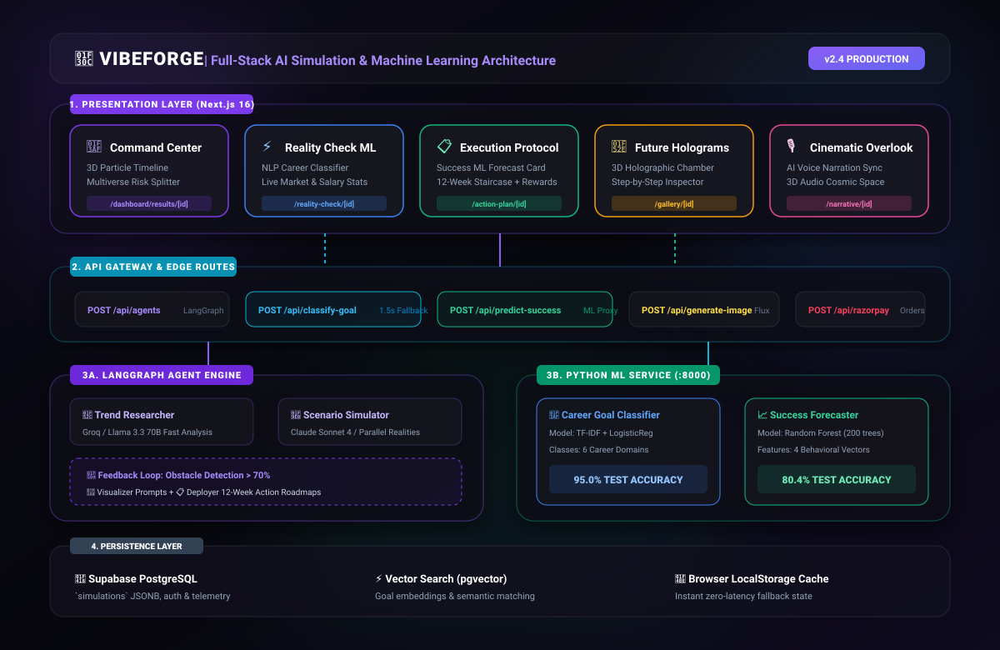
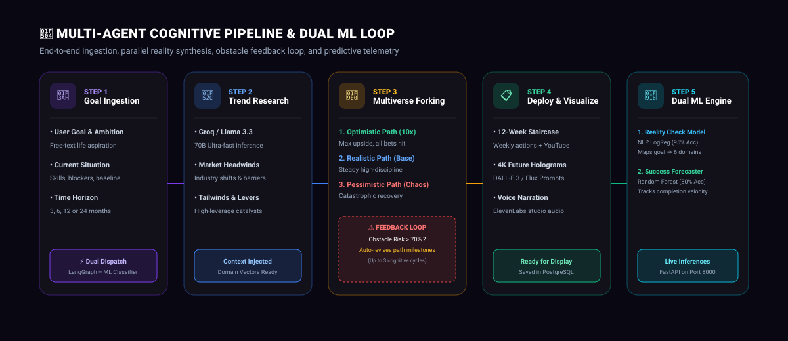

<div align="center">

# 🌌 VibeForge — AI Life Simulator & Multiverse Architect

### *Simulate Parallel Realities. Predict Outcomes with ML. Conquer Your Trajectory.*

<br/>

[](https://nextjs.org)
[](https://react.dev)
[](https://python.org)
[](https://fastapi.tiangolo.com)
[](https://scikit-learn.org)
[](https://threejs.org)
[](https://tailwindcss.com)
[](https://langchain-ai.github.io/langgraph/)
[](https://supabase.com)

<br/>

<p align="center">
  <a href="#-master-system-architecture"><b>Master Architecture</b></a> •
  <a href="#-cognitive-multi-agent-pipeline"><b>Multi-Agent Pipeline</b></a> •
  <a href="#-machine-learning-engine"><b>ML Models &amp; Telemetry</b></a> •
  <a href="#-command-center--portals"><b>3D Portals</b></a> •
  <a href="#-quick-start-guide"><b>Quick Start</b></a> •
  <a href="#-api-reference"><b>API Docs</b></a>
</p>

</div>

---

## 🎯 Executive Overview

**VibeForge** is an AI-powered life simulation and multi-agent execution ecosystem. By combining **LangGraph multi-agent cognitive planning graphs**, **Scikit-learn behavioral and career machine learning models**, and **React Three Fiber 3D holographic environments**, VibeForge allows users to test-drive their future, ground aspirations in real-time market data, and track daily execution velocity.

```
🔮 3 Parallel Realities       🤖 95.0% Accuracy ML Classifier      📈 80.4% Success Forecaster
   (Optimistic / Real / Chaos)    (TF-IDF + LogisticRegression)         (RandomForest Telemetry)

⚡ 12-Week Staircase Roadmap   🔮 3D Holographic Chamber             🎙️ 3D Voice Narration Lounge
   (With live YouTube tutorials)  (Step-by-step scanner & inspector)   (Studio-grade AI voiceover)
```

---

## 🏗️ Master System Architecture

<div align="center">
  
</div>

<br/>

### 🧱 Architectural Layer Breakdown

| Layer | Technologies | Role &amp; Responsibilities |
|---|---|---|
| **1. Presentation** | `Next.js 16`, `React 19`, `Tailwind v4`, `Three.js`, `R3F`, `Framer Motion` | Renders 5 distinct glassmorphic portals, interactive 3D particle graphs, 3D holographic projection chambers, and milestone reward modals. |
| **2. API Gateway** | `Next.js App Router (Edge & Server Routes)` | Dispatches requests to LangGraph or the Python ML microservice, enforces `1.5s` abort timeouts, and provides transparent zero-latency rule-based fallbacks. |
| **3. Machine Learning** | `FastAPI`, `Uvicorn`, `Scikit-Learn`, `Pandas`, `Joblib` | High-throughput asynchronous inference microservice hosting the **Career Goal Classifier** and **Success Probability Predictor**. |
| **4. Multi-Agent AI** | `LangGraph`, `Groq Llama 3.3 70B`, `Claude Sonnet 4`, `DALL-E 3 / Flux` | Stateful 4-agent graph executing market research, 3-path timeline synthesis with a `>70%` obstacle feedback loop, and prompt engineering. |
| **5. Persistence** | `Supabase PostgreSQL`, `pgvector`, `Browser LocalStorage` | Hybrid caching model guaranteeing offline demo resilience while persisting user profiles, check-in history, and multiverse trajectories. |

---

## 🔄 Cognitive Multi-Agent Pipeline

<div align="center">
  
</div>

<br/>

### 🧠 Step-by-Step Agentic Flow

```mermaid
sequenceDiagram
    autonumber
    actor User as 👤 User
    participant Web as 🖥️ Next.js Client
    participant Gateway as ⚡ /api/agents
    participant Res as 🔬 Trend Researcher
    participant Sim as 🧠 Scenario Simulator
    participant Vis as 🎨 Visualizer Agent
    participant Dep as 📋 Action Deployer
    participant ML as 🤖 Python ML (:8000)
    participant DB as 🐘 Supabase DB

    User->>Web: Input Ambition, Situation & Horizon
    Web->>Gateway: POST /api/agents (Goals & Context)
    
    rect rgb(30, 20, 50)
        Note over Gateway,Dep: LangGraph Multi-Agent Orchestration
        Gateway->>Res: Analyze Macro Headwinds & Levers (Groq Llama 3.3 70B)
        Res-->>Sim: Industry Constraints & Acceleration Vectors
        Sim->>Sim: Fork Realities (Optimistic, Realistic, Pessimistic)
        Note over Sim: Risk > 70%? Auto-refines path (Up to 3 loops)
        Sim-->>Dep: Structured Milestone Trajectory
        Dep->>Dep: Generate 12-Week Staircase & YouTube Curricula
        Dep-->>Vis: Milestone Prompt Specifications
        Vis->>Vis: Synthesize 4K DALL-E / Flux Prompts
    end

    Vis-->>DB: Store Complete Simulation JSONB Document
    DB-->>Web: Render Command Center & 3D Visuals

    rect rgb(20, 40, 40)
        Note over Web,ML: Dual Machine Learning Inferences
        Web->>ML: POST /classify (Free-text goal)
        ML-->>Web: { "category": "ml_engineer", "confidence": 0.9093 }
        Web->>ML: POST /predict-success (Check-in velocity vector)
        ML-->>Web: { "status": "on_track", "probability": 0.9585 }
    end
```



---

## 🤖 Machine Learning Engine

VibeForge features an autonomous Python ML microservice serving real-time inferences to Next.js on port `8000`.

```
ml/
├── data/
│   ├── career_goals_dataset.csv     # 100+ curated goal sentences across 6 categories
│   └── success_dataset.csv          # 280-row behavioral feature telemetry dataset
├── models/
│   ├── vectorizer.pkl               # Fitted TfidfVectorizer (ngram_range=(1,2))
│   ├── classifier.pkl               # Trained LogisticRegression Career Classifier (95.0% Acc)
│   └── success_model.pkl            # Trained RandomForest Success Predictor (80.4% Acc)
├── train_classifier.py              # Career classifier training & evaluation script
├── train_success_model.py           # Success model training & feature importance script
├── serve.py                         # FastAPI microservice application
└── requirements.txt                 # Python dependencies
```

### 1. Goal-to-Career NLP Classifier (`train_classifier.py`)
- **Objective**: Converts free-text user ambitions into deterministic industry taxonomy to drive the **Reality Check** panel.
- **Model Pipeline**: `TfidfVectorizer(ngram_range=(1, 2), sublinear_tf=True)` ➔ `LogisticRegression(C=5.0, max_iter=1000)`
- **Evaluation**: **95.0% Test Accuracy** across 6 career domains.

```
                    precision    recall  f1-score   support
  commercial_pilot       1.00      1.00      1.00         4
    data_scientist       1.00      1.00      1.00         3
    full_stack_dev       1.00      1.00      1.00         3
       ml_engineer       0.80      1.00      0.89         4
             other       1.00      0.67      0.80         3
   product_manager       1.00      1.00      1.00         3
          accuracy                           0.95        20
```

### 2. Success Probability Forecaster (`train_success_model.py`)
- **Objective**: Dynamically predicts the likelihood of completing the roadmap on time based on client-side check-in velocity.
- **Model**: `RandomForestClassifier(n_estimators=200, max_depth=6, class_weight='balanced')`
- **Evaluation**: **80.4% Test Accuracy** with clear feature importance weights:

```
  avg_completion_percent         ███████████████████████ 58.61%
  completion_trend               ███████ 18.17%
  num_checkins_missed            █████ 12.51%
  weeks_elapsed_ratio            ████ 10.70%
```

---

## ⚡ Command Center & Exploration Portals

<table width="100%">
  <tr>
    <td width="50%" valign="top">
      <h3>🎯 1. Command Center</h3>
      <p><code>/dashboard/results/[id]</code></p>
      <ul>
        <li><b>3D Multiverse Timeline</b>: Three.js particle graph displaying diverging optimistic, realistic, and pessimistic branches.</li>
        <li><b>⚠️ Take a Massive Risk</b>: Simulates sudden timeline shatter (100x Growth vs Bankruptcy recovery).</li>
        <li><b>Motivational Hero</b>: Dynamic executive transmission backdrop.</li>
      </ul>
    </td>
    <td width="50%" valign="top">
      <h3>⚡ 2. Reality Check ML Panel</h3>
      <p><code>/dashboard/reality-check/[id]</code></p>
      <ul>
        <li><b>Detected Career Badge</b>: Displays ML category with live confidence (e.g. <i>95% confidence</i> or fallback tag).</li>
        <li><b>3 Glassmorphic Stat Cards</b>: Market Demand, Entry–Senior Salary benchmarks, Top In-Demand Skills.</li>
        <li><b>Top Hiring Companies</b> &amp; Year-over-Year growth rates.</li>
      </ul>
    </td>
  </tr>
  <tr>
    <td width="50%" valign="top">
      <h3>📋 3. Execution Protocol</h3>
      <p><code>/dashboard/action-plan/[id]</code></p>
      <ul>
        <li><b>Success Forecast Card</b>: Animated probability dial showing <code>On Track</code> vs <code>At Risk</code>.</li>
        <li><b>12-Week Staircase</b>: Weekly actionable tasks + integrated 1-click YouTube tutorial search.</li>
        <li><b>Milestone Coupon Unlocks</b>: Earn 10% (Bronze), 25% (Silver), 35% (Gold), up to <b>50% Lifetime OFF</b> (Galactic Sovereign).</li>
        <li><b>Export Engine</b>: 1-click Apple/Google Calendar <code>.ics</code> and print-ready PDF briefs.</li>
      </ul>
    </td>
    <td width="50%" valign="top">
      <h3>🔮 4. Future Holograms 3D Chamber</h3>
      <p><code>/dashboard/gallery/[id]</code></p>
      <ul>
        <li><b>3D Projection Chamber</b>: Rotating laser emitter rings, glowing vertical light cone beam, and volumetric cyber dust.</li>
        <li><b>Step-by-Step Navigation</b>: Previous/Next step controls, timeline scrubber (<code>M3</code>, <code>M6</code>, <code>M12</code>), and keyboard hotkeys (<code>←</code>, <code>→</code>, <code>Space</code>).</li>
        <li><b>Hologram Inspector</b>: Click-to-expand 4K synthetic memory viewer with AI prompt inspect.</li>
      </ul>
    </td>
  </tr>
</table>

---

## 🛠️ Complete Tech Stack

```
┌───────────────────┬─────────────────────────────────────────────────────────────────┐
│ Framework         │ Next.js 16.2.7 (App Router, Turbopack, React 19)                │
│ Language          │ TypeScript 5 (Strict Mode)                                      │
│ Styling & Design  │ Tailwind CSS v4, Custom 24-Depth Token Palette                  │
│ 3D Graphics       │ Three.js, React Three Fiber (@react-three/fiber), Drei          │
│ Motion Engine     │ Framer Motion 12 (Spring Physics & AnimatePresence)             │
│ ML Microservice   │ FastAPI 0.111.0, Uvicorn, Python 3.11+                          │
│ Machine Learning  │ Scikit-Learn 1.4.2, Pandas, NumPy, Joblib                       │
│ AI Orchestration  │ LangGraph (@langchain/langgraph), Groq Llama 3.3 70B, Claude 4  │
│ Image Generation  │ OpenAI DALL-E 3 & Flux via Pollinations API                     │
│ Voice Synthesis   │ ElevenLabs Text-to-Speech Streaming API                         │
│ Database          │ Supabase PostgreSQL, pgvector extension                         │
│ Monetization      │ Razorpay (with zero-config simulated test sandbox)              │
└───────────────────┴─────────────────────────────────────────────────────────────────┘
```

---

## 🚀 Quick Start Guide

### Prerequisites
- **Node.js**: `v18.18.0` or higher
- **Python**: `v3.10` or higher
- **npm** or **pnpm**

---

### 1️⃣ Clone the Repository
```bash
git clone https://github.com/lokojitcoder123/VibeForge.git
cd VibeForge
```

---

### 2️⃣ Set Up and Run the Python ML Microservice
```bash
# Navigate to the ML directory
cd ml

# Install Python ML dependencies
pip install -r requirements.txt

# Train both machine learning models (creates .pkl artifacts)
python train_classifier.py
python train_success_model.py

# Start the FastAPI ML microservice on port 8000
python -m uvicorn serve:app --reload --port 8000
```
> 🟢 ML Microservice is now active at `http://127.0.0.1:8000` (Interactive API docs at `http://127.0.0.1:8000/docs`).

---

### 3️⃣ Configure Environment Variables
In the project root, copy the example environment file:
```bash
cp .env.local.example .env.local
```

Edit `.env.local` with your configuration:
```env
# AI Providers
OPENROUTER_API_KEY=your_openrouter_key
GROQ_API_KEY=your_groq_key
ANTHROPIC_API_KEY=your_anthropic_key
OPENAI_API_KEY=your_openai_key
ELEVENLABS_API_KEY=your_elevenlabs_key

# Supabase (Optional for local demo mode)
NEXT_PUBLIC_SUPABASE_URL=https://your-project.supabase.co
NEXT_PUBLIC_SUPABASE_ANON_KEY=your_supabase_anon_key

# Razorpay (Optional — Demo Sandbox active if left as placeholder)
RAZORPAY_KEY_ID=rzp_test_placeholder
RAZORPAY_KEY_SECRET=rzp_test_placeholder
NEXT_PUBLIC_RAZORPAY_KEY_ID=rzp_test_placeholder
```

---

### 4️⃣ Start the Next.js Development Server
In a separate terminal window:
```bash
# In the root directory
npm install
npm run dev
```

Open **[http://localhost:3000](http://localhost:3000)** in your browser! 🎉

---

## 🔌 API Reference

### 🐍 Python ML Microservice (`http://localhost:8000`)

#### `GET /health`
```json
{
  "status": "ok",
  "classifier_loaded": true,
  "success_model_loaded": true
}
```

#### `POST /classify`
```json
// Request
{ "text": "I want to become a machine learning engineer at a top AI company" }

// Response (200 OK)
{
  "category": "ml_engineer",
  "confidence": 0.9093
}
```

#### `POST /predict-success`
```json
// Request
{
  "avg_completion_percent": 72.5,
  "completion_trend": 1.5,
  "weeks_elapsed_ratio": 0.4,
  "num_checkins_missed": 1
}

// Response (200 OK)
{
  "status": "on_track",
  "probability": 0.9585
}
```

---

### ⚡ Next.js API Routes (`http://localhost:3000/api`)

| Endpoint | Method | Description |
|---|---|---|
| `/api/classify-goal` | `POST` | Proxies goal text to ML service with `1.5s` timeout; falls back to static keyword map if service is offline. |
| `/api/predict-success` | `POST` | Proxies feature vector to Random Forest model; returns `{ unavailable: true }` if offline. |
| `/api/agents` | `POST` | Initiates the 4-agent LangGraph generation workflow. |
| `/api/generate-image` | `POST` | Synthesizes 4K visual assets for Future Holograms chamber. |
| `/api/voice` | `POST` | Streams studio-grade ElevenLabs narration audio. |
| `/api/razorpay/order` | `POST` | Creates checkout orders with automated coupon discount calculations. |

---

## 🔒 Fault-Tolerant Offline Architecture

VibeForge is designed with resilience at its core:

- **ML Microservice Resiliency**: If FastAPI is offline or times out after 1.5s, the frontend automatically falls back to a rule-based NLP taxonomy and displays a `"keyword match"` badge.
- **Database Fallback**: If Supabase connectivity is interrupted, the platform operates seamlessly using browser `localStorage` and a rich `DEMO_SIMULATION` fallback.
- **Payment Sandbox**: If live Razorpay API keys are not supplied, the checkout page automatically switches into an interactive instant-confirmation demo mode.

---

## 📄 License & Attribution

Distributed under the **MIT License**.

```
MIT License

Copyright (c) 2026 VibeForge Team

Permission is hereby granted, free of charge, to any person obtaining a copy
of this software and associated documentation files (the "Software"), to deal
in the Software without restriction, including without limitation the rights
to use, copy, modify, merge, publish, distribute, sublicense, and/or sell
copies of the Software, and to permit persons to whom the Software is
furnished to do so, subject to the following conditions:

The above copyright notice and this permission notice shall be included in all
copies or substantial portions of the Software.
```

<div align="center">

**Built with ❤️ for advanced AI multi-agent life architecture and simulation**

*"The best way to predict the future is to forge it."*

</div>
