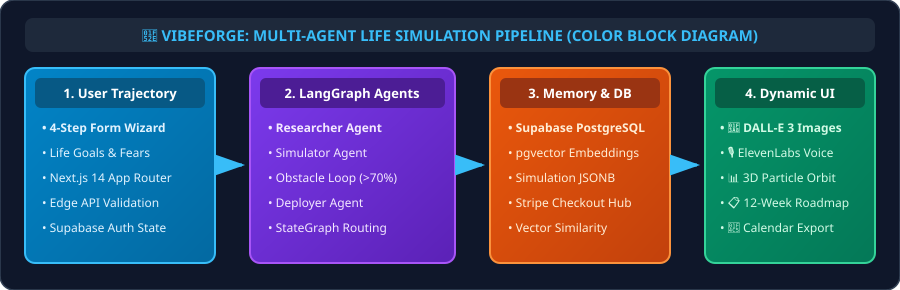

<div align="center">

# 🚀 VibeForge

### AI-Powered Future Self Simulator & Life Architect

*See your future self before you get there.*

[](https://nextjs.org)
[](https://www.typescriptlang.org)
[](https://tailwindcss.com)
[](https://supabase.com)
[](https://langchain-ai.github.io/langgraph/)

</div>

---

## 🎯 What is VibeForge?

VibeForge is a multi-agent AI application that **simulates parallel futures** based on your goals, generates **visual timelines**, creates **AI-generated images** of your potential future, provides **voice narrations**, and produces **actionable deployment plans** — all powered by a LangGraph orchestration pipeline.

### ✨ Key Features

| Feature | Description |
|---------|-------------|
| 🔮 **3 Parallel Futures** | Optimistic, realistic, and pessimistic life paths |
| 🎨 **AI-Generated Visuals** | DALL-E 3 creates "synthetic memories" of your future |
| 🎙️ **Voice Narration** | ElevenLabs narrates your future day |
| 📊 **3D Interactive Timeline** | Three.js particle visualization with branching paths |
| 📋 **12-Week Action Plans** | Concrete weekly steps with habit tracking |
| 📅 **Calendar Export** | Sync milestones to your calendar |

---

## 🏗️ System Architecture (Full-Color Block Diagram)

<div align="center">
  
</div>

```
┌─────────────────────────────────────────────────────┐
│                   Next.js 14 Frontend               │
│  ┌─────────┐ ┌──────────┐ ┌──────────┐ ┌────────┐  │
│  │ Landing  │ │Dashboard │ │  Form    │ │Results │  │
│  │  Page    │ │          │ │  Wizard  │ │+ 3D TL │  │
│  └─────────┘ └──────────┘ └──────────┘ └────────┘  │
├─────────────────────────────────────────────────────┤
│                   API Routes (Edge)                  │
│  /api/agents  /api/generate-image  /api/voice       │
│  /api/stripe/checkout  /api/stripe/webhook           │
├─────────────────────────────────────────────────────┤
│              LangGraph Agent Pipeline                │
│                                                      │
│  ┌──────────┐   ┌──────────┐   ┌──────────┐        │
│  │Researcher│──▶│Simulator │──▶│Visualizer│        │
│  │(Groq)    │   │(Claude)  │   │(Prompts) │        │
│  └──────────┘   └──┬───┘──┘   └──────────┘        │
│                    │    ▲           │                 │
│                    │    │ Feedback   │                │
│                    ▼    │ Loop      ▼                │
│              ┌──────────┐   ┌──────────┐            │
│              │ Obstacle  │   │ Deployer │            │
│              │ Detection │   │(Plans)   │            │
│              └──────────┘   └──────────┘            │
├─────────────────────────────────────────────────────┤
│            Supabase (PostgreSQL + pgvector)           │
│  ┌──────────────┐  ┌─────────────────────┐          │
│  │ simulations  │  │    embeddings       │          │
│  │ (JSONB paths)│  │ (vector similarity) │          │
│  └──────────────┘  └─────────────────────┘          │
└─────────────────────────────────────────────────────┘
```

### Agent Pipeline

1. **🔬 Researcher** (Groq + Llama 3.3 70B) — Analyzes trends, obstacles, and opportunities
2. **🧠 Simulator** (Anthropic Claude Sonnet 4) — Generates 3 parallel future scenarios with feedback loop
3. **🎨 Visualizer** — Creates DALL-E 3 prompts for synthetic future memories
4. **📋 Deployer** (Groq + Llama 3.3 70B) — Produces actionable 12-week plans with habit trackers

The **time-travel feedback loop**: If the Simulator detects an obstacle with >70% probability, it automatically revises the path (up to 3 iterations).

---

## 🛠️ Tech Stack

| Layer | Technology |
|-------|-----------|
| **Frontend** | Next.js 14 (App Router), React, TypeScript |
| **Styling** | Tailwind CSS v4, CSS Custom Properties |
| **3D Graphics** | Three.js, React Three Fiber, Drei |
| **Animations** | Framer Motion |
| **Backend** | Next.js API Routes (Edge Runtime) |
| **Database** | Supabase (PostgreSQL + pgvector) |
| **AI Orchestration** | LangGraph (@langchain/langgraph) |
| **AI Models** | Claude Sonnet 4 (Anthropic), Llama 3.3 70B (Groq) |
| **Image Generation** | DALL-E 3 (OpenAI) |
| **Voice Synthesis** | ElevenLabs Text-to-Speech |
| **Payments** | Stripe (Checkout + Webhooks) |
| **Deployment** | Vercel |

---

## 🚀 Quick Start

### Prerequisites

- Node.js 18+
- npm
- Supabase project (free tier works)
- API keys for: Anthropic, Groq, OpenAI, ElevenLabs, Stripe

### 1. Clone & Install

```bash
git clone https://github.com/your-username/vibeforge.git
cd vibeforge
npm install
```

### 2. Configure Environment

```bash
cp .env.local.example .env.local
```

Edit `.env.local` with your API keys:

```bash
# Supabase
NEXT_PUBLIC_SUPABASE_URL=https://your-project.supabase.co
NEXT_PUBLIC_SUPABASE_ANON_KEY=your-anon-key
SUPABASE_SERVICE_ROLE_KEY=your-service-role-key

# AI Services
ANTHROPIC_API_KEY=sk-ant-...
GROQ_API_KEY=gsk_...
OPENAI_API_KEY=sk-...
ELEVENLABS_API_KEY=...

# Stripe
STRIPE_SECRET_KEY=sk_test_...
NEXT_PUBLIC_STRIPE_PUBLISHABLE_KEY=pk_test_...
STRIPE_WEBHOOK_SECRET=whsec_...

# App
NEXT_PUBLIC_APP_URL=http://localhost:3000
```

### 3. Set Up Database

Run the SQL migrations in your Supabase SQL Editor (in order):

1. `supabase/migrations/001_enable_extensions.sql`
2. `supabase/migrations/002_create_tables.sql`
3. `supabase/migrations/003_match_function.sql`

### 4. Run Development Server

```bash
npm run dev
```

Open [http://localhost:3000](http://localhost:3000) 🎉

---

## 📁 Project Structure

```
vibeforge/
├── src/
│   ├── app/
│   │   ├── page.tsx                    # Landing page
│   │   ├── layout.tsx                  # Root layout
│   │   ├── globals.css                 # Design system tokens
│   │   ├── pricing/page.tsx            # Pricing page
│   │   ├── dashboard/
│   │   │   ├── layout.tsx              # Dashboard shell (sidebar)
│   │   │   ├── page.tsx                # Dashboard home
│   │   │   ├── simulate/page.tsx       # 4-step form wizard
│   │   │   └── results/[id]/page.tsx   # Results + 3D timeline
│   │   └── api/
│   │       ├── agents/route.ts         # LangGraph orchestration
│   │       ├── generate-image/route.ts # DALL-E 3 proxy
│   │       ├── voice/route.ts          # ElevenLabs TTS proxy
│   │       └── stripe/
│   │           ├── checkout/route.ts   # Stripe Checkout
│   │           └── webhook/route.ts    # Stripe webhooks
│   ├── components/
│   │   ├── ui/                         # Button, Card, Badge, Input
│   │   └── three/
│   │       └── ParticleTimeline.tsx     # 3D particle visualization
│   ├── lib/
│   │   ├── agents/                     # LangGraph agent definitions
│   │   │   ├── graph.ts                # StateGraph orchestration
│   │   │   ├── state.ts                # SimulationAnnotation
│   │   │   ├── researcher.ts           # Groq researcher
│   │   │   ├── simulator.ts            # Claude simulator
│   │   │   ├── visualizer.ts           # Prompt generator
│   │   │   └── deployer.ts             # Action plan creator
│   │   ├── ai/                         # AI SDK configurations
│   │   ├── supabase/                   # Client/server/middleware
│   │   ├── stripe.ts                   # Stripe config
│   │   └── utils.ts                    # Utilities
│   ├── types/
│   │   ├── agents.ts                   # Agent & simulation types
│   │   └── database.ts                 # DB schema types
│   └── middleware.ts                   # Auth middleware
├── supabase/migrations/                # SQL migration files
├── vercel.json                         # Deployment config
└── .env.local                          # Environment variables
```

---

## 💰 Pricing Tiers

| Feature | Explorer (Free) | Pro ($9/mo) | Enterprise ($99/mo) |
|---------|:-:|:-:|:-:|
| Simulations | 3 | Unlimited | Unlimited |
| Future Paths | ✅ | ✅ | ✅ |
| AI Images | 1/sim | 5/sim | Unlimited |
| Voice Narration | ❌ | ✅ | ✅ |
| Action Plans | Basic | Full 12-week | Custom |
| Calendar Export | ❌ | ✅ | ✅ |
| Team Features | ❌ | ❌ | ✅ |
| API Access | ❌ | ❌ | ✅ |

---

## 🚀 Deploy to Vercel

[](https://vercel.com/new/clone?repository-url=https://github.com/your-username/vibeforge)

1. Click the button above
2. Add your environment variables in the Vercel dashboard
3. Deploy! 🎉

---

## 📄 License

MIT © 2026 VibeForge

---

<div align="center">

**Built with ❤️ and AI for the 2026 hackathon competition circuit**

*"The best way to predict the future is to simulate it."*

</div>
